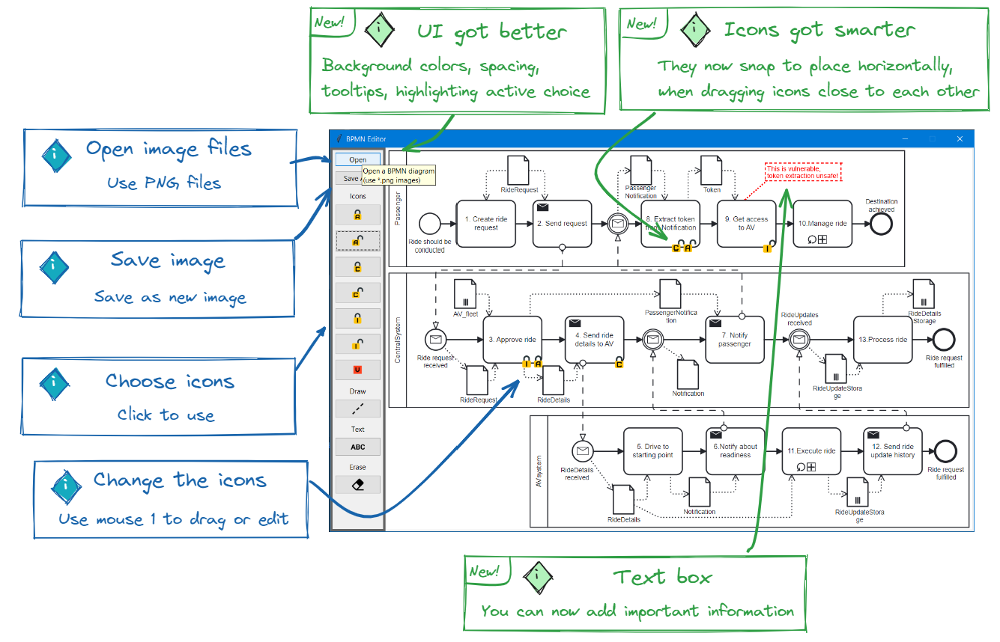

# BPMN Editor

Update: 21.05.2023

This project is a computer program that will allow users to open and edit BPMN model image files and edit them.
Many BPMN language modeling tools allow the editing of the model, but they lack the ability to add custom
icons or annotations.

The program includes following features:
1. GUI editor to load and view image
2. Add/remove of custom icons
3. Draw on the canvas
4. Save the image

Used libraries:
* tkinter
* Pillow

## Troubleshooting
### Problems saving the image
The image saving functionality may in some cases include a little more or less of the screen than expected. This is 
because the application uses screenshotting as the way to save the image and having scaling turn to something other 
than 100% seems to affect the ability to use the coordinates correctly for the capturing of the image. For the best 
experience, please turn screen scaling to 100% when using this app.

## References
* https://docs.python.org/3/library/tkinter.html
* https://tkinter-docs.readthedocs.io/en/latest/widgets/canvas.html
* https://pillow.readthedocs.io/en/stable/reference/Image.html
* https://pillow.readthedocs.io/en/stable/reference/ImageTk.html
* https://pillow.readthedocs.io/en/stable/reference/ImageGrab.html
* https://realpython.com/python-gui-tkinter/#building-your-first-python-gui-application-with-tkinter
* https://www.tutorialspoint.com/python/tk_canvas.htm#
* https://www.youtube.com/watch?v=Jl1xsH6MR1g&t=254s&ab_channel=Codemy.com
* https://stackoverflow.com/questions/15839491/how-to-clear-tkinter-canvas
* https://stackoverflow.com/questions/10865116/tkinter-creating-buttons-in-for-loop-passing-command-arguments
* https://stackoverflow.com/questions/7142342/get-window-position-size-with-python

## Authors
Group B, Karl Tamberg and Joosep Parts

## Source code

https://github.com/Nurech/python-group-work
